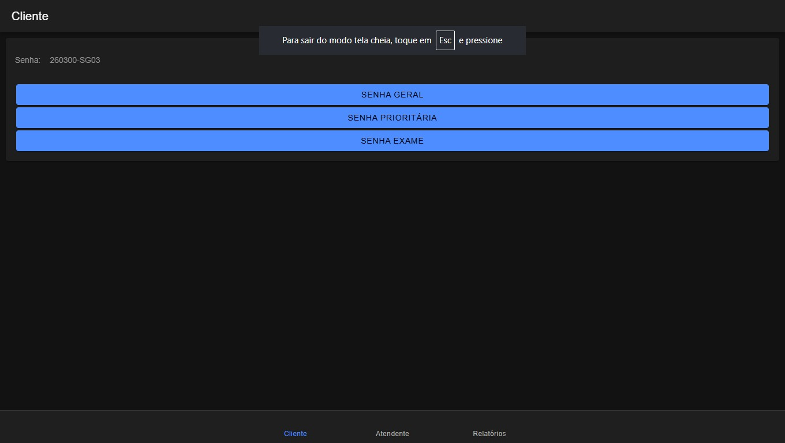
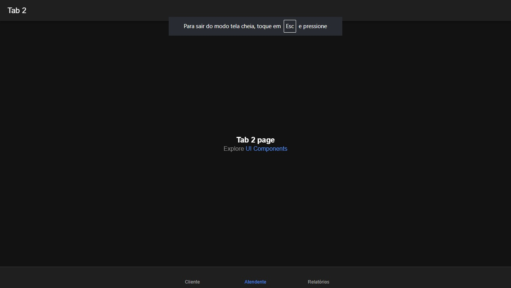
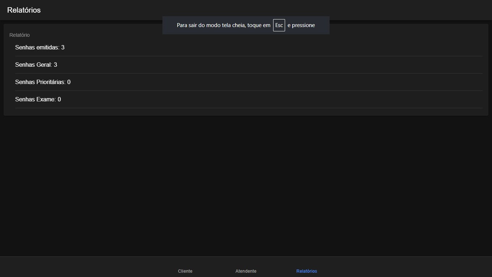

# MobileTicketsIonic

Sistema de Controle de Atendimento para laboratórios médicos desenvolvido com Ionic Angular.

## Sobre o Projeto

Aplicativo mobile para gerenciamento de filas de atendimento em laboratórios médicos, com suporte a 3 tipos de senha:

- **SP** – Senha Prioritária
- **SG** – Senha Geral  
- **SE** – Senha para Retirada de Exames

## Tecnologias

- Ionic Framework
- Angular
- Capacitor
- TypeScript

## Funcionalidades

- Emissão de senhas por tipo
- Contagem automática por categoria
- Relatório com total de senhas emitidas

## Telas do Projeto

### Cliente


### Atendente


### Relatórios


## Como Executar
```bash
npm install
ionic serve
```

## Licença
MIT